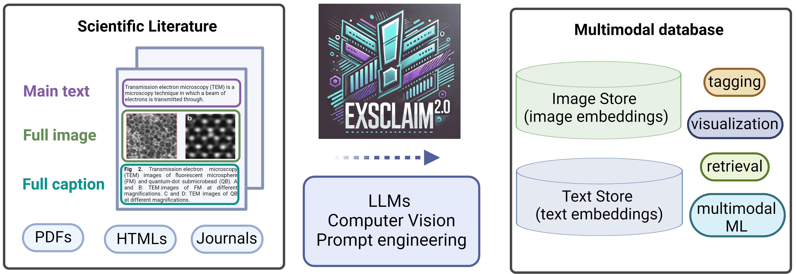

.. EXSCLAIM 2.0 documentation master file, created by
   sphinx-quickstart on Fri Oct 25 16:06:59 2024.
   You can adapt this file completely to your liking, but it should at least
   contain the root `toctree` directive.

EXSCLAIM 2.0
=======================================

Welcome to the EXSCLAIM 2.0 documentation! This guide will walk you through the essential components of using our pipeline to create multimodal datasets from scientific literature.

   Schematic of the EXSCLAIM 2.0 pipeline. Our framework synergistically combines large language models (LLMs) with prompt engineering for image captioning and understanding, and computer vision models for image separation and information extraction. It processes open-access articles, PDF and HTML file formats, extracting text and images, and organizing them into a structured format. This structured data enables the creation of databases that can be used for metadata extraction, training multimodal models, and efficient information retrieval.

Check out our Hugging Face Space for microscopy image retrieval: `Hugging Face Space <https://huggingface.co/spaces/kvriza8/microscopy_images>`_.

Contents:
---------

.. toctree::
   :maxdepth: 1

   self
   installation
   quick_start
   Nature_exsclaim_search
   PDFScraper
   HTMLScraper
   train_yolov11
   Microscopy_CLIP_retrieval

